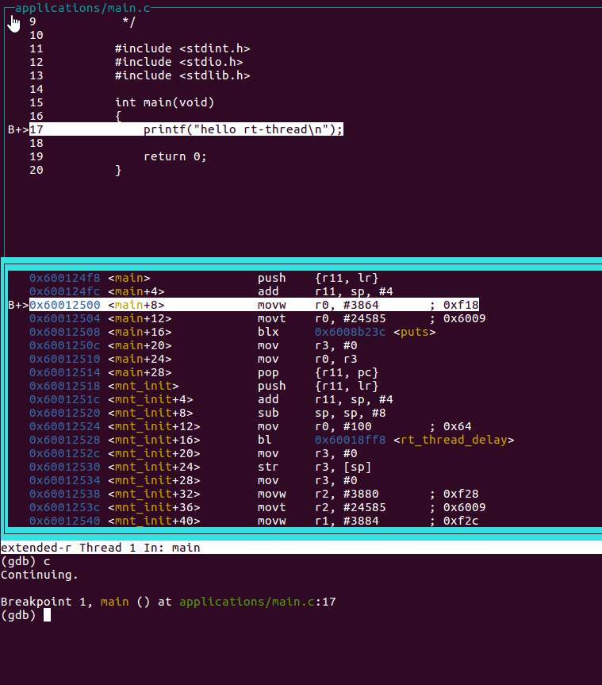
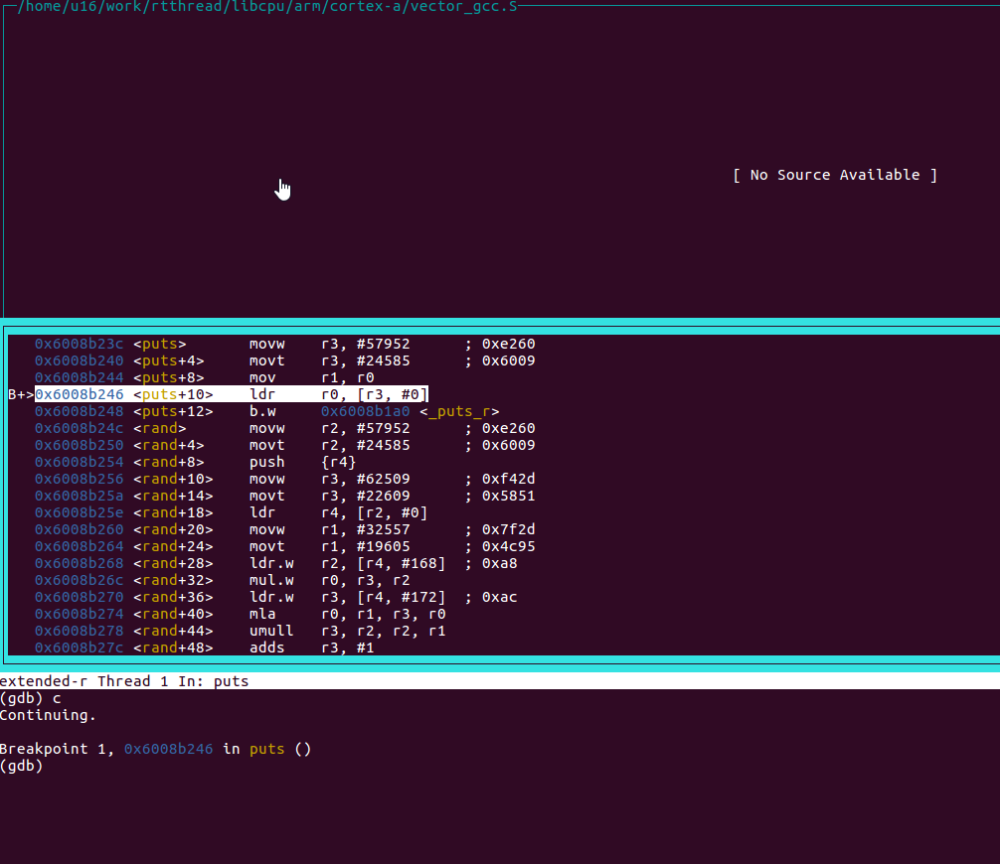
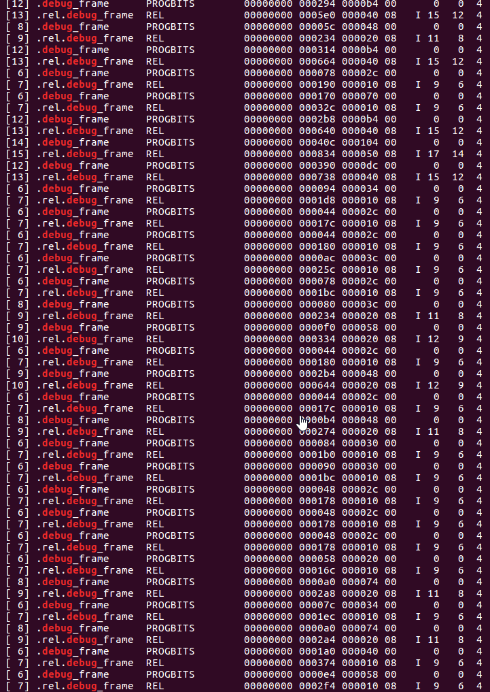
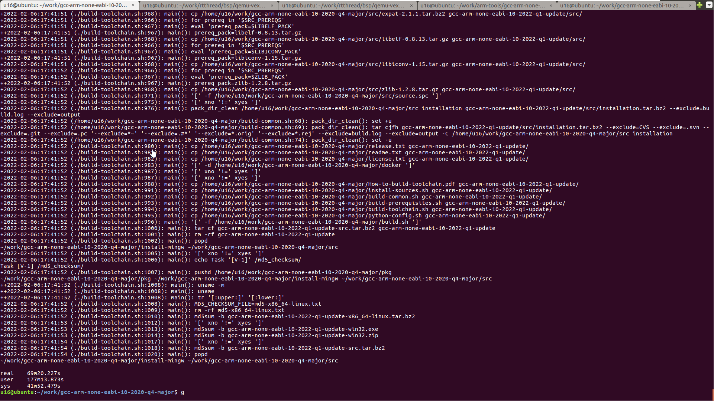
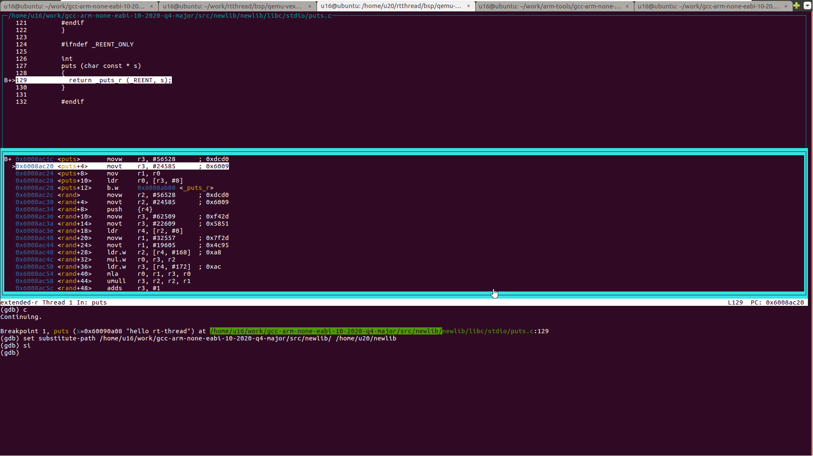

## 如何调试`GCC`的C标准库

#### `Newlib`简介

作为一名嵌入式软件工程师，我们在非`linux`嵌入式开发过程中，除了直接使用`Keil MDK`和`IAR`等集成开发环境（`IDE`）之外，还可能直接或者间接（许多基于`eclipse/vscode`的`IDE`开发环境）地使用过`GCC`作为编译器，而`Newlib`则是`GCC`编译器中针对非`linux`操作系统平台所提供的C标准库。 它最初由 `Cygnus Support `创建， 目前由`Red Hat`的开发人员`Jeff Johnston`和`Corinna Vinschen`进行维护，`Newlib`的所有代码都是属于开放源码许可的$$^{[1]}$$ 。`Newlib`目前在各种重量级的开源嵌入式项目中被广泛使用，如`RT-Thread、zephyr、FreeRTOS 、Arduinio`等等，所以其地位是非常重要的。

#### 问题背景

虽然`Newlib`在最早期的版本中就设计了`_reent`结构体来保存每个线程私有的数据，并向下层单独提供了一套以`_r`作为后缀（`open_r`, `write_r`等）的可重入移植接口，试图通过这两个手段实现线程安全，但其内部的一些函数在实现上并未利用好上述机制从而导致线程不安全的现象发生，比如C标准库中常用的`strtod、sprintf、sscanf、snprintf、vsnprintf`等函数在格式化浮点数时会共用一片全局内存，如果多线程同时使用`snprintf`函数就可能导致死机的情况$$^{[2]}$$，此外`Newlib`提供的`memcpy/memset`等函数也会有几率导致死机等问题$$^{[3]}$$ $$^{[4]}$$ $$^{[5]}$$ 。除此之外其他的底层bug在`Newlib`中也许还有更多，并且由于`Newlib`目前在各类大型的嵌入式开源项目被直接使用，由于`Newlib`导致的问题之后可能会影响到不少项目，此时就需要我们对照`Newlib`的源码对其底层的实现进行调试。

首先我们尝试一下能否直接使用arm官方发布的`GCC`编译工具链对底层的`Newlib`进行调试，我们先从arm官网下载了编译好的`Newlib`版本`GCC`编译工具链，然后用该编译工具链以`debug`模式编译`RT-Thread`，并对其中两个函数设置了断点（main函数：位于`RT-Thread`的应用层之中，puts函数：位于C标准库中）。

首先触发的是main函数的断点，可以在`GDB`的`TUI`界面看到正确地显示了源代码信息：

然后触发的是位于C标准库的puts函数的断点，但是在`GDB`的`TUI`界面中提示没有调试信息，并且看不到对应的`Newlib`源码：

从main函数的现象我们可知我们的编译选项是带了调试信息的，但是为什么无法调试C标准库呢，于是我们从命令行进入编译工具链的安装路径，然后用命令`readelf -S ./arm-none-eabi/lib/libc.a  | grep debug`即可使用readelf工具查看是否包含完整的调试信息，下面是我们得到的结果：

而`GDB`调试所需要的段信息如下$$^{[6]}$$：

| .debug_abbrev        | Abbreviations used in the .debug_info section           |
| -------------------- | ------------------------------------------------------- |
| `.debug_aranges`     | Lookup table for mapping addresses to compilation units |
| `.debug_frame`       | Call frame information                                  |
| `.debug_info`        | Core DWARF information section                          |
| `.debug_line`        | Line number information                                 |
| `.debug_loc`         | Location lists used in the `DW_AT_location` attributes  |
| `.debug_macinfo    ` | Macro information                                       |
| `.debug_pubnames`    | Lookup table for global objects and functions           |
| `.debug_pubtypes `   | Lookup table for global types                           |
| `.debug_ranges`      | Address ranges used in the `DW_AT_ranges` attributes    |
| `.debug_str`         | String table used in `.debug_info`                      |
| `.debug_types`       | Type descriptions                                       |

从结果对比分析目前arm发布的`Newlib`版本`GCC`编译工具链是不带完整调试信息的，尤其缺少关键的`.debug_info`段，所以用arm官网的编译工具链是不能达到我们对照`Newlib`的源码对其底层实现进行调试的目的，需要手动构建一个带调试信息和配套调试源码的编译工具链。

#### 重新构建调试版本编译工具链

由于下面`GCC`编译工具链的构建都是在`linux`环境中完成的，因此开始构建之前需要已经安装好了一个`linux`发行版（这里使用`ubuntu`），并且对`linux`的命令行操作比较熟悉。

1. 先用下面的命令在`ubuntu`中安装好编译工具链所需的软件包

   `sudo apt-get -f install -y build-essential gcc-mingw-w64-i686 g++-mingw-w64-i686 binutils-mingw-w64-i686 autoconf autogen bison dejagnu flex flip gawk git gperf gzip nsis openssh-client p7zip-full perl python-dev libisl-dev scons tcl texinfo tofrodos wget zip texlive texlive-extra-utils libncurses5-dev`

2. 从[arm官网](https://developer.arm.com/tools-and-software/open-source-software/developer-tools/gnu-toolchain/gnu-rm/downloads)下载`GCC`编译工具链的源码包，这里我选择了`gcc10`，下载了[gcc-arm-none-eabi-10-2020-q4-major-src.tar.bz2](https://developer.arm.com/-/media/Files/downloads/gnu-rm/10-2020q4/gcc-arm-none-eabi-10-2020-q4-major-src.tar.bz2?revision=8f69a18b-dbe3-45ec-b896-3ba56844938d&hash=DFE1526DE2E0877A4627DCB9C59C71F4)这一个压缩包

3. 在命令行下使用` tar jxvf gcc-arm-none-eabi-10-2020-q4-major-src.tar.bz2`对源码包进行解压

4. 解压完成后进入解压后的目录`gcc-arm-none-eabi-10-2020-q4-major`，然后使用`./install-sources.sh`命令解压各个软件组件的源码压缩包，此过程中同时会下载需要的一些其他软件包，可能会因为网络原因而失败，需要确保完整下载了依赖的软件压缩包

5. 使用`./build-prerequisites.sh`命令来编译依赖的组件

6. 最后就是正式的编译过程了，我们在完成了前面的步骤后可以使用如下命令来开始`GCC`编译工具链的编译`./build-toolchain.sh --skip_steps=manual,strip --build_type=native,debug`。这一句最后一段的`--build_type=native,debug`是为了编译出运行在本地机器同架构的并且带C库调试信息的`GCC`编译工具链。根据机器的性能等待几十分钟到几小时不等，新的编译工具链就新鲜出炉啦

7. 最后我们可以分别在`install-mingw`目录和`install-native`目录可以看到编译好的`windows`和`linux`平台的`GCC`编译工具链

8. 最后编译完成的后的窗口如下：

   

#### 使用新的编译工具链加载源码进行调试

为了验证所编译的`GCC`编译工具链，我们将编译工具链和对应的`Newlib`源码部署到一台新的`linux`机器上，然后跟背景介绍中一样在`qemu-vexpress-a9`这个bsp下进行测试，以下是本次的操作步骤：

1. 先修改`rtconfig.py`文件将编译工具链改为我们新的编译工具链，注意编译模式改为`debug`模式。

2. 通过`scons`命令编译固件，然后运行`./qemu-dbg.sh`脚本启动调试模式。

3. 新开一个命令行窗口，将我们新编译的编译工具链全路径添加到`PATH`环境变量，然后执行`arm-none-eabi-gdb rtthread.elf -ex "tar ext localhost:1234"`,`GDB`将自动连接第2步创建的调试服务器。在`GDB`支持`TUI`的情况下可以使用`layout src`打开源代码窗口方便之后对照源代码来调试。

4. 因为`Newlib`在编译时携带了源代码文件的绝对路径，我们在其他机器中使用时由于路径不同就需要将这个路径修正为实际的路径，如果是同一台机器则不需要此步骤。我们在第3步的窗口运行`set substitute-path 编译器时的Newlib源码目录 当前部署机器上的Newlib源码目录`即可。这一步是很关键的一步，一定要注意一下路径是不是正确的，举个例子，在我编译的机器上原来的`Newlib`源代码路径是`/A/Newlib/`，而在新的机器上我把`Newlib`源代码放在了`/B/Newlib`目录，所以用命令`set substitute-path /A /B`就可以让`GDB`把原来库文件中携带的与编译机器有关的绝对路径修正为我们部署机器的路径。

5. 对`Newlib`中想要调试的函数打断点，现就可以愉快地在对照源代码和反汇编对`Newlib`开始调试了。

5. 最后，如果大家在使用`RT-Thread`的过程中发现疑似底层C标准库的问题，大家可以去论坛发帖$$^{[7]}$$，论坛地址在第7个参考文献的链接里，论坛有许多志愿者大佬帮忙解答$$^{[5]}$$。

   

### 参考文献：

[1]  https://sourceware.org/newlib/

[2] https://github.com/mysterywolf/rt-thread-test-bench/blob/master/newlib-threadsafe/bug-sprintf-hardfault.c

[3] https://github.com/RT-Thread/rt-thread/pull/5460

[4] https://github.com/lvgl/lvgl/issues/2790#issuecomment-980479598

[5] https://club.rt-thread.org/ask/article/3376.html

[6]  Exploring the DWARF debug format information. *IBM Developer* https://developer.ibm.com/articles/au-dwarf-debug-format/ (2013).

[7] https://club.rt-thread.org/index.html
